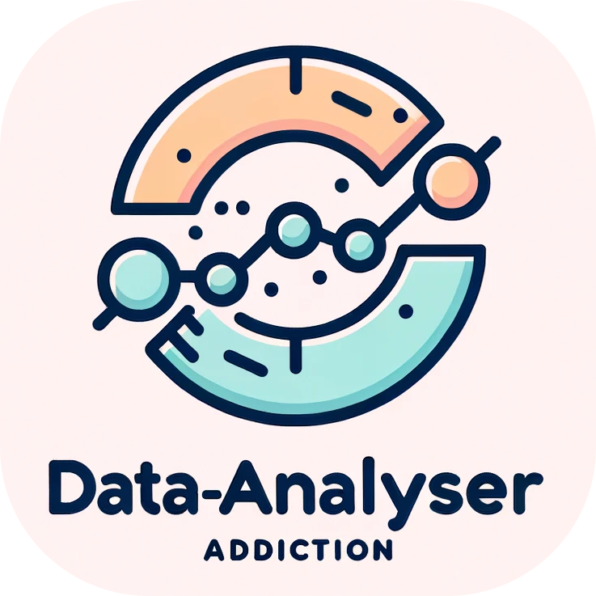

    

# User Data Analysis Tool

This project provides tools to analyze user data to help combat addiction. By tracking and visualizing user activities, it gives valuable insights into behavior patterns and triggers.

## Features

- **Data Logging**: Tracks user actions in real-time and logs them for analysis.
- **Visual Analysis**: Offers multiple visual tools, including daily, hourly, and weekly charts to understand user behavior.
- **Secure Login System**: Ensures only authorized personnel can access the data and charts.

## Usage

1. **Logging Data**: Click on any of the colored buttons on the homepage to log a particular action or event.
2. **Viewing Statistics**: Use the statistics buttons to view daily, hourly, or weekly data visualizations.